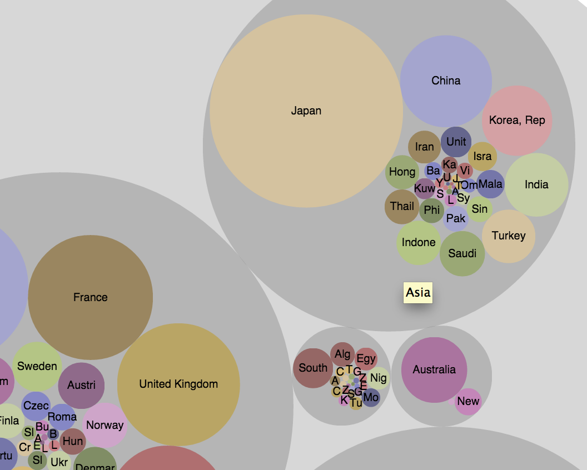
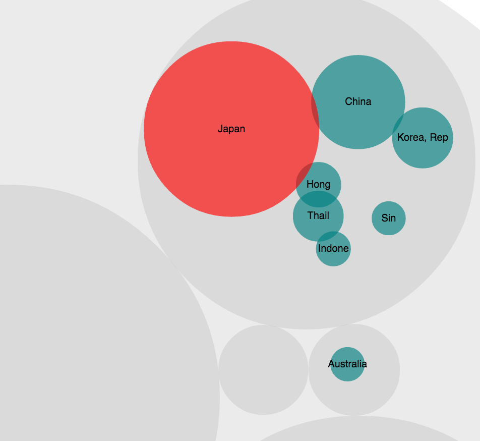
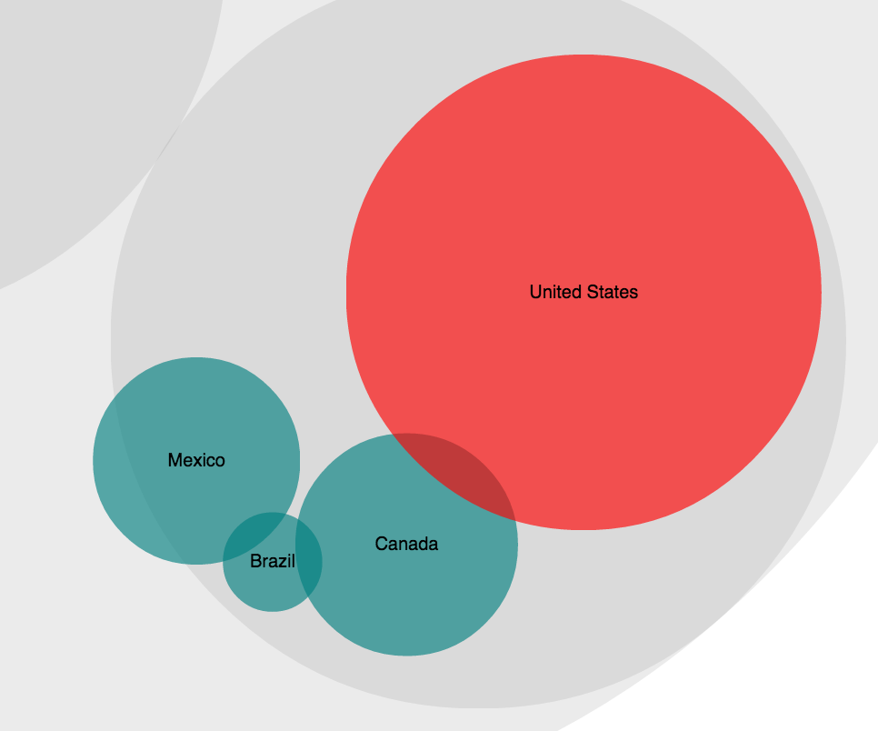
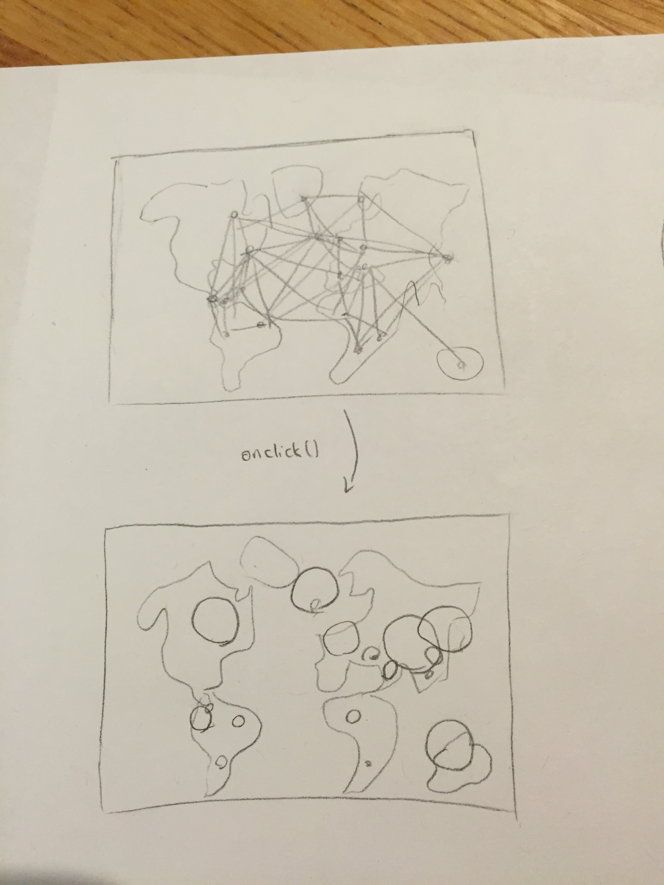
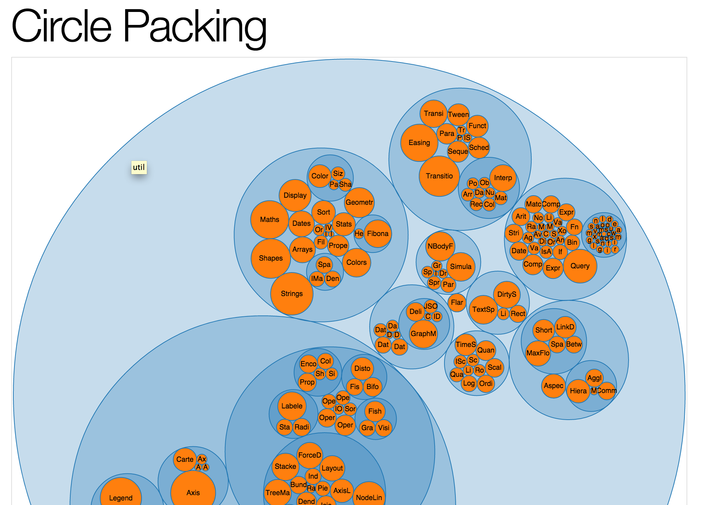

Design Project
=====

Goals
-------
This vizualisation aims to communicate 3 types of relationships between the countries:

1. **Geographical relationships** of the countries, expressed through the packed nodes

2. **Relative GDP**, expressed through the different sizes of the nodes

3. **Relative Exports,** expressed through the different sizes of the nodes (onclick)

Functioning
-------
This representation avoides the clustering of nodes by packing them in a D3 layout. This maintains the comparative relationships of the geographic locations by groupding countries in the same continent under one circle. This treats geographic location as an ordinally ordered variable as it is most commonly understood, rather than as quantitative variables defined by their longitude and latitue.

  

When you click on a certain country, its major export partners remain on the pag, but all other countries are removed from the visualization. This is to best attract attention to the important data and also reduce clustering.

  

Furthermore, the sizes of these countries are changed to represent the corresponding proportions of the export that each country holds. For example, in the picture below, since Canada has a larger sphere than Brazil, we can infer that the US exports more to Canada than to Brazil. The size of the country  that is clicked is maintained, and the other countries adjust in relation. Since GDP and total export is often correlating, this can also show the significance of the countries trade on a global scale.

  

## How I came to these goals

In brainstorming the design, I considered ways to represent the geographic locations. One way to do this was to append a world map in the background, and calibrate the nodes so that their longitude and latitude would point to the right locations on the map. By visualizing this information, we could show for example that countries are more likely to trade with other countries on the same continent.

I further feature I considered adding would happen when a certain node was clicked. Then the node would expand in size, to show the relative GDP of the country within the global context. Below is the sketch of the design.

  

However, this representation is very clustered and is not refined to communicate the important data. This is because geographic location is being interpreted as quantitative data, through longitude and latitude. However, for the purpose of this visualization, we are more concerned with the groupings of continent rather than the exact location; this data makes more sense to us categorically. Thus although we will be representing less accurate data, the graph is simplified 

Furthermore, nodes are good but they cannot communicate the significance of each datapoint, represented in gdp or export size. This is why, by using the pack layout, I figured that I could take advantage of both of these elements.

My TF then pointed me to a D3 layout online by mbostock called circle packing, and used this as the basis of my design.

  

Shortcomings
-----------
There are two shortcomings of this design that should be mentioned.

First, while this representation can effectively convey data for the countries with larger GDP, smaller countries have small nodes and even smaller nodes for their major export partners. Thus, this layout is good to identify large global trends and communicate the trade relations that are most significant on a global scale, a different layout is more desirable when trying to communicate the smaller countries.

One solution to this would have been to use this [zoomable pack layout](http://mbostock.github.io/d3/talk/20111116/pack-hierarchy.html). However, by the time I realized this shortcoming, I was too far into the implementation to have time to revert back.

The second shortcoming is to do with the relative sizes of the nodes after click. Initially, I had planned to set the maximum domain value of the rScale (the scale that defines the radius), to the total export of the country in interest. As defined in the json, this would have been:

**rScale.domain[0, total_export_value]**

Then, to calculate the radius of the export partners, I used

**rScale(total_export)**

for each countries individual export value.

However, upon inplementing this, it became clear that the other countries would become far too small, since the proportion of a total export that any individual country constituted was very small. This was still true when I took to square root of these values so that the area (not the radius) of the circles would be proportionate. In the end, I created the visualization with the rScale max using the sum of the export values of the top 10 export partners present in the dataset. Although this is not a precise representation, this was the most communicatable form that I could manage given the dataset.
