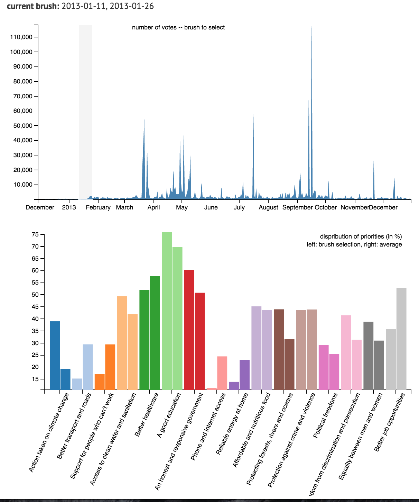

# Answers for Questions
------
### Q5a
**Question:** Choose __one__ comparison scenario and create at least three alternative designs that would allow this comparison.

**Design 1:**

	

This is the sketch for the first design conception. This involves adding another brush onto count.vis so that we can select two time frames. The proportionate distribution of the priorities will then be reflected into the stacked horizontal bar chart below. This is a useful desing since it theoretically allows you to add in as many brushes as you want with ease, since you can keep adding another horizontal bar chart below the previous one.

	

However, when I attempted to recreate the design, it became clear that due to the large number of priorities that needed to be displayed (16), each priority could only be allocated a short length in the bar, and thus comparisons between them became very difficult.

**Design 2:**

	

Above is a sketch for the second design conception. This is similar to the first in that it involves features for multiple brushing on count.vis and renders a visualization for the ranges that are passed through. The difference is that the vertical and horizontal variables are replaced. This means that the relative proportions of each of the priorities within the brush selection are positioned side by side, allowing us to allocate more length and space to each of the priorities so that they can be compared easily.

	

This is what a real implementation would look like. With this visualization, it is easier to infer information regarding which specific priority has a larger proportion in the brush selection. However, because there are so many priorities to visualize, the whole visualization becomes spread out vertically, and it is harder to infer larger trends.

The third design is explained in the question below:

-----
### Q5b
**Question:** Implement one design in your visualization for **PrioVis** and explain why you have chosen this design.

**Design 3:**

The following is a sketch of the design that I actually implemented. The code for the implementation can be found here: [design/](/design)

	

Here is a sketch of the design implementation. While the x axis is the same as the one used in Prior.vis, the y axis represents the percentages of the priorities within the selection.

This is calculated by first summing all of the counts within the brush selection and then dividing the counts for the priority by the aggregated value of all of the counts within the brush selection.

**(priority[i] / total_count) * 100**

This allows us to compare not the total number of votes in the selection (since that would vary largely depending on the time and span and is also not the information we are interested in).

	

In the actual implementation, bar on the left of each pair represents the percentage of people who voted for a particular priority within the given brush selection, while the bar on the right of each pair represents the average percentage of people who voted for a particular priority across the whole dataset.
This allows to compare how the preferences of the people who voted within a particular time span deviate from the average preferences.

### Q5c
**Question:** As a very minimal case study submit a screenshot of an interesting pattern which you have found with your method and briefly describe the pattern.

-

The first pattern that I noticed was that people who voted earlier on tend to have higher priorities for "Action taken on climate change" than the average voter. This can be seen very clearly in the screenshot below

	

This pattern contrasts greatly with a brush selection during a high number of voters during September 2013. Below, we can see that these people value "Action taken on climate change" far less than average, while they value "Phone and internet access" far more than the average voter. If this peak happened during a social network campaign to encourage more people to fill the survey, then perhaps this could explain this trend (it is fairly easy to imagine that people on social networking sites are more likely to value phone and internet access).

	

However, the second screenshot can tell us that it was not the case that the people who voted earlier had particularly high priorities for "Action taken on climate change", since if we take into account that there was an extremely large number of people who filled out this survey during the social network campaign, and these people did not value climate change, then this would have drawn the average down significantly enough to make other people seem like they were particularly compared.
In other words, we can reasonably conclude that people who voted during September 2013 may have skewed the average in a particularly bais direction.